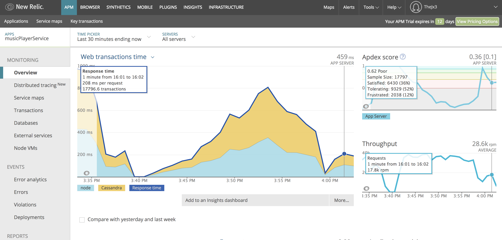
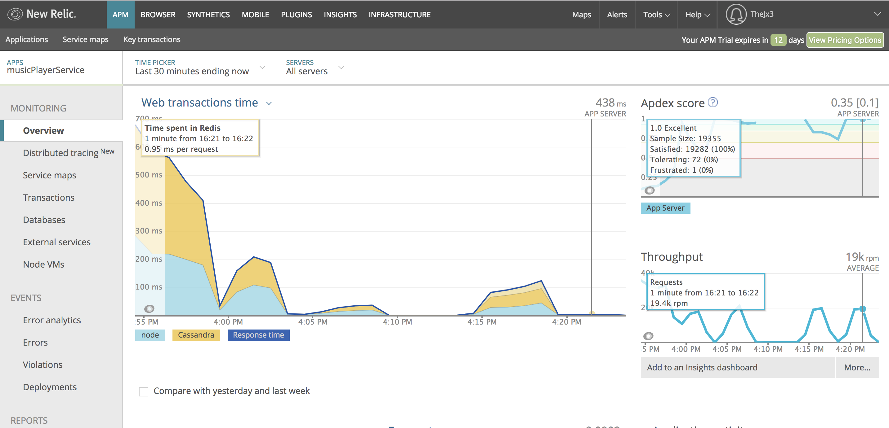

# TravelInn: A Mock HostelWorld Reviews Module
I refactored legacy code for the back end of a mock HostelWorld reviews module.

## Related Projects

  - https://github.com/TheJx3/suggestedTracksService
  - https://github.com/TheJx3/commentsListAndSubmissionService

## Table of Contents

1. [Description](#Description)
1. [Requirements](#Requirements)

## Description
 I loaded the database with 10M primary records. Through Nginx load balancer and Redis caching, I was able to reach +2800RPS with <100ms latency.

 Using loader.io and New Relic, I load tested my data and found that it could handle only about 100RPS. After additional configuration and refactoring, I was able to get to +1500 RPS. Ask me about the project!

## Requirements
### To Run This Module
From within the root directory:
npm run start

## Images
> Nginx load balancer used.
### Without Redis caching:
<!-- .element height="50%" width="50%" -->
### With Redis caching:
<!-- .element height="50%" width="50%" -->
